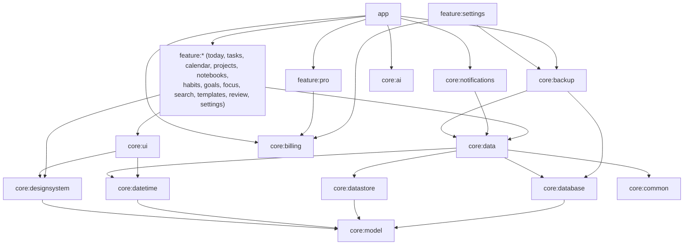

# Architecture

Plan-B is a single-activity Compose app organised as a multi-module Gradle build. It follows
the layered architecture recommended for Android: UI (Compose + ViewModels) → data
(repositories) → local data sources (Room, DataStore, files). The only network code is the
optional AI assistant client in `core:ai` (off by default, the user's own provider key); Plan-B
Pro purchases go through the installed Cafe Bazaar app (`core:billing`).

## Modules

| Module | Responsibility |
|---|---|
| `core:model` | Plain Kotlin domain types (tasks, projects, notes, habits, goals, events, focus sessions, templates, settings), recurrence and habit-schedule encodings, habit statistics, goal pace, Markdown conversion. No Android framework types in its API. |
| `core:common` | `TimeProvider` (the only clock), dispatchers and the application scope, digit localisation (`Digits`, `NumberFormatter`), `SearchNormalizer`, `runCatchingSafely`, a minute ticker for "today". |
| `core:datetime` | Calendar engines (Jalali via ICU, Gregorian), month grids, the recurrence engine, reminder trigger computation with DST handling, and the resource-backed `PlannerDateFormatter`. |
| `core:database` | Room entities, DAOs, relations, the FTS4 `search_index`, migrations and exported schemas. |
| `core:datastore` | User preferences in Preferences DataStore with tolerant per-key parsing. |
| `core:data` | Repositories (the single source of truth for each feature), entity↔model mappers, search indexing, `ReminderScheduler` contract, SAF file helpers. |
| `core:notifications` | `AlarmReminderScheduler` (implements `ReminderScheduler`), reminder/reschedule broadcast receivers, notification channels, private notifications and deep links. |
| `core:backup` | Versioned ZIP backup (with attachment files), validation, transactional restore, CSV/JSON/Markdown export and import. |
| `core:billing` | Plan-B Pro: `BillingClient` (Cafe Bazaar via Poolakey, or a fake in debug builds), on-device purchase verification, `EntitlementRepository` with an offline cache. See [docs/PRO.md](docs/PRO.md). |
| `core:ai` | Optional AI assistant infrastructure: provider catalog, settings with the key encrypted by the Android Keystore, `AiClient` (OkHttp; OpenAI and Anthropic wire formats). The only module that declares `INTERNET`. |
| `core:designsystem` | Theme, color/typography/tokens and generic components. See [DESIGN_SYSTEM.md](DESIGN_SYSTEM.md). |
| `core:ui` | Planner-specific shared composables: cards, pickers (date/time/color/icon), editor rows, recurrence and reminder menus, heatmap, formatting locals, and Pro gating (`ProFeature`, `LocalProAccess`, `ProGate`, `rememberProGuard`). |
| `core:testing` | Test helpers (`FakeTimeProvider`). |
| `feature:*` | One module per feature: screens, ViewModels and type-safe navigation routes. Features never depend on each other; the app wires navigation between them. `feature:pro` is the Plan-B Pro screen; other features gate Pro actions only through `core:ui` (`LocalProAccess`), which the app provides. |
| `feature:reports` | Plan-B Pro statistics, "My year" and their PDF export (aggregation in `core:model`, `StatisticsDao` reads, `PdfReportWriter` in `core:ui`). |
| `app` | `Application`, `MainActivity`, root scaffold, navigation host, onboarding, locale bootstrap; Plan-B Pro widgets (Glance), quick-settings tiles, launcher shortcuts, launcher icon aliases and the phone side of the Wear OS sync. |
| `wear` | Wear OS companion app (Plan-B Pro): today's tasks and habits over the Wearable Data Layer. Built separately; not part of the Cafe Bazaar upload. |
| `baselineprofile`, `benchmark` | Macrobenchmark modules (profile generation and measurements). |
| `build-logic` | Convention plugins (`planb.android.application/library/library.compose/feature/room`, `planb.hilt`, `planb.roborazzi`). |

## UI layer

- **Single activity**, Compose only. `MainActivity` installs the system splash screen, keeps it
  only until stored settings are read, and passes notification deep links to navigation.
- **Navigation Compose with type-safe routes** (`@Serializable` route objects/classes per
  feature). `PlanBNavHost` registers every feature graph; the bottom bar shows five top-level
  destinations (Today, Calendar, Tasks, Notebooks, More). Back stacks of top-level tabs are saved
  and restored.
- **ViewModels** (Hilt) expose a single `StateFlow` of UI state (usually `stateIn(...,
  WhileSubscribed(5_000))`, with explicit loading/success/error states). One-off events (snackbars)
  use `SharedFlow`/channels. Screens are split into a stateful `*Destination` composable and a
  stateless `*Screen` composable that only receives state and callbacks, which is what the
  screenshot tests render.
- **Editors** keep their form in `SavedStateHandle` (serialized as JSON), so process death and
  configuration changes never lose input. Loading an existing item happens only when no saved
  form exists.
- **Writes that must finish** (autosave when leaving the note editor, committing an undone
  delete) run on an injected application-wide `CoroutineScope` instead of `viewModelScope`.
- **Global UI state** — language, theme, calendar system, digits, motion — comes from
  `UserSettings` and is provided through `PlanBTheme` and `CompositionLocal`s
  (`LocalDateFormatter`, `LocalToday`, `PlannerLocals.numbers`).

## Data layer

- Repositories are interfaces with `Offline*` implementations bound in `DataModule`. Reads are
  `Flow`s from Room/DataStore; writes are `suspend` functions that run in Room transactions.
- Every write that changes searchable text also updates the FTS index inside the same
  transaction (`SearchIndexer`), so search never shows stale rows.
- Tasks and events with reminders call `ReminderScheduler` after a successful write. The
  scheduler is an interface in `core:data`, implemented in `core:notifications`, which keeps the
  data layer free of Android alarm APIs and lets tests record scheduling calls.
- Recurring tasks: completing an occurrence creates the next one from the rule and anchor
  date; recurring events are expanded on read for the requested range.
- All dates are stored canonically (epoch days, minutes of day, epoch-millisecond instants).
  Calendar systems only affect presentation and month arithmetic. Times of day are "floating"
  local times, so a 09:00 task stays at 09:00 when the time zone changes.

## Time and calendars

`TimeProvider` is the only source of "now" and the zone; tests swap in `FakeTimeProvider`.
`JalaliEngine` uses `android.icu.util.Calendar` with the Persian calendar and caches month
boundaries per year; `GregorianEngine` uses `java.time`. The recurrence engine generates lazy
sequences of occurrences anchored at the start date, clamps month days (31 → 30/29), supports
counts and end dates, and starts Jalali weeks on Saturday.

## Background work and notifications

- Reminders use `AlarmManager`: exact alarms when the user allows them, otherwise
  `setAndAllowWhileIdle`. Reminders need wall-clock precision and the app has no deferrable
  background jobs (no sync, no uploads), so WorkManager is not used.
- `ReminderReceiver` re-reads the item before notifying (completed or deleted items never
  notify) and schedules the next occurrence. `RescheduleReceiver` restores all alarms after
  boot, app updates, clock or time-zone changes and exact-alarm permission changes.
- Notifications are `VISIBILITY_PRIVATE` with a generic public version for the lock screen and
  open the related screen through `planb://open/...` deep links.
- Focus sessions are stored as timestamps (`startedAt`, `runningSince`, accumulated time), so
  the remaining time is always computed from the clock and survives process death; an alarm
  completes the session when it ends.

## Persistence

- Room database `planb.db` (schema version 3, exported to `core/database/schemas`; v3 holds the
  tables of every Pro feature). Migrations
  are explicit and tested; there is no destructive fallback. See [DATABASE.md](DATABASE.md).
- DataStore holds preferences. Unknown or malformed values fall back to defaults per key.
- Backups are ZIP files written through the Storage Access Framework; restore validates the
  whole archive before replacing anything, in one transaction. See
  [docs/BACKUP_FORMAT.md](docs/BACKUP_FORMAT.md).
- Android Auto Backup and device transfer are disabled (`allowBackup=false`,
  `data_extraction_rules.xml`) so private notes never leave the device without the user's
  explicit export.

## Dependency injection

Hilt everywhere: `@HiltAndroidApp` application, `@AndroidEntryPoint` activity and receivers,
`@HiltViewModel` ViewModels. Modules: `CommonModule` (clock, application scope),
`DispatchersModule`, `DatabaseModule`, `DataStoreModule`, `DataModule`, `NotificationsModule`,
`AppModule` (app version), `BillingModule` (Cafe Bazaar in release builds, the fake store in
debug builds), `BillingStorageModule` and `AiModule` (device-only DataStore files that are never
exported). Tests replace the database (in-memory) and the clock (frozen) with
`@TestInstallIn` modules.

## Localization

Persian is the default language and the layout is mirrored for RTL. Language, calendar system,
first day of week and digit style are independent settings. See
[docs/LOCALIZATION.md](docs/LOCALIZATION.md).

## Performance

Lists are lazy with stable item keys (plus content types on mixed lists such as Today), heavy
work runs off the main thread, queries are indexed, and a baseline profile ships with the app. See
[docs/PERFORMANCE.md](docs/PERFORMANCE.md).
