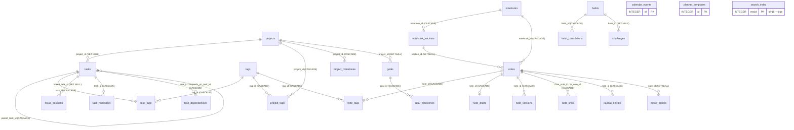

# Plan-B Database

Plan-B keeps all user data in one local Room (SQLite) database. Nothing is uploaded. (The
optional Pro device-calendar sync only talks to Android's calendar provider on the device.) This
document is derived from the code in `core/database`, plus the search helpers in `core/data` and
`core/common`.

| Item | Value | Source |
|---|---|---|
| Database class | `PlanBDatabase` | `core/database/src/main/kotlin/com/behnamjalali/planb/core/database/PlanBDatabase.kt` |
| File name | `planb.db` (`PlanBDatabase.NAME`). It does not depend on the display name. | same |
| Schema version | `3` (`PlanBDatabase.VERSION`) | same |
| Schema export | `exportSchema = true`, written to `core/database/schemas/` | `build-logic/.../AndroidRoomConventionPlugin.kt` |
| Migrations | `Migrations.ALL = [MIGRATION_1_2, MIGRATION_2_3]` | `core/database/.../Migrations.kt` |
| Builder | `Room.databaseBuilder(...).addMigrations(*Migrations.ALL)`, with **no** destructive fallback | `core/database/.../DatabaseModule.kt` |
| DI | Hilt `SingletonComponent`. Each DAO is provided from the singleton database. | `DatabaseModule.kt` |

Paths in this document are shortened to `core/database/.../` and stand for
`core/database/src/main/kotlin/com/behnamjalali/planb/core/database/`.

---

## 1. Canonical storage formats

Stored values never depend on the display calendar (Jalali or Gregorian), the locale or the
digit style. `Converters.kt` defines how `java.time` types become SQLite columns:

| Kotlin type | Column type | Stored as | Converter |
|---|---|---|---|
| `LocalDate` | `INTEGER` | **Epoch day**, counted from 1970-01-01 (`toEpochDay()`) | `localDateToLong` / `longToLocalDate` |
| `LocalTime` | `INTEGER` | **Second of day**, 0–86399 (`toSecondOfDay()`) | `localTimeToInt` / `intToLocalTime` |
| `Instant` | `INTEGER` | **Epoch milliseconds, UTC** | `instantToLong` / `longToInstant` |
| `Boolean` | `INTEGER` | 0 or 1 (Room default) | — |
| Enums and value objects | `TEXT` | Stable string keys, mapped in `core/data/.../Mappers.kt` | — |

Other conventions:

- **Durations and offsets are integers with the unit in the column name**:
  `reminder_offset_minutes`, `estimated_minutes`, `actual_minutes`, `planned_duration_ms`,
  `actual_duration_ms`, `accumulated_ms`.
- **Floating local times.** A task or event stores a local date (epoch day) and an optional
  local time (second of day). There is no time zone. 09:00 stays 09:00 in whatever zone the
  device is in (see the KDoc on `core/model/.../CalendarEvent.kt`). An absolute instant is
  computed only when a reminder is scheduled, by `ReminderTime.triggerAt(date, time,
  offsetMinutes, zone)` in `core/datetime`. Date-only items use 09:00
  (`DEFAULT_DATE_ONLY_TIME`). In a DST gap the time resolves forward; in an overlap the
  earlier offset is used.
- **Timestamps** (`created_at`, `updated_at`, `completed_at`, `started_at`, …) are real
  instants, stored as epoch milliseconds in UTC.
- **String-encoded values** (written by `core/model` and `core/data/Mappers.kt`):
  - `tasks.status`: `TaskStatus` name (`TODO`, `IN_PROGRESS`, `DONE`).
  - `tasks.priority`: `Priority.weight` (`0` NONE, `1` LOW, `2` MEDIUM, `3` HIGH).
  - `recurrence` (tasks and events): RRULE-like text, for example
    `FREQ=WEEKLY;INTERVAL=1;BYDAY=MO,WE;CAL=JALALI;UNTIL=2026-12-31;COUNT=10`. See
    `RecurrenceRule.encode/decode`. `CAL` records the calendar used for month and year
    arithmetic.
  - `habits.schedule`: `DAILY`, `DAYS:1,3,5` (ISO day numbers), `WEEKLY:<times>` or
    `EVERY:<n>` (`HabitSchedule.encode/decode`).
  - `color`: `AccentColor.key` (`lavender`, `mint`, `peach`, `powder_blue`, `rose`, `sand`,
    `sage`, `slate`).
  - `icon`: `PlannerIcon.key` (`folder`, `book`, `star`, …).
  - `projects.status`: `ProjectStatus` name.
  - `projects.progress_mode`: `ProgressMode` name (`TASKS`, `MILESTONES`, `MANUAL`).
  - `focus_sessions.status`: `FocusStatus` name (`RUNNING`, `PAUSED`, `COMPLETED`,
    `CANCELLED`).
  - `planner_templates.type`: `TemplateType` name. `payload` holds JSON.
  - `notes.content`: a JSON-encoded `NoteDocument` (`{"version":1,"blocks":[…]}`).
    `content_format` is `blocks-v1` (`NoteFormat.BLOCKS_V1`).
  - `habits.health_metric`: `HealthMetric` name (`STEPS`, `SLEEP_MINUTES`, `HYDRATION_ML`,
    `ACTIVE_MINUTES`, `DISTANCE_METERS`).
  - v3 enum-like columns (`task_reminders.kind`, `attachments.owner_type` / `kind`,
    `challenges.kind` / `status`, `activity_log.entity_type` / `action`,
    `calendar_links.local_type`) store constant names listed in §3.18–3.29.
- Unknown enum strings fall back to a default when read (`enumOf(name, default)`,
  `AccentColor.fromKey`, and so on). Corrupt values therefore degrade gracefully instead of
  crashing.

---

## 2. Entity-relationship overview



`calendar_events`, `planner_templates`, `search_index`, `saved_filters`, `attachments`
(polymorphic owner, see §3.23), `badges`, `activity_log` and `calendar_links` have no foreign
keys. Every foreign
key uses `ON UPDATE NO ACTION`. Room turns on `PRAGMA foreign_keys` for app connections, so
the cascade and set-null rules are enforced.

---

## 3. Tables

All entities are in `core/database/.../entity/Entities.kt`. "NN" means `NOT NULL`. A Kotlin
default value (for example `description = ""`) is only a constructor default. No SQL
`DEFAULT` is declared, so every insert writes every column.

### 3.1 `tasks` (`TaskEntity`)

| Column | Type | Null | Notes |
|---|---|---|---|
| `id` | INTEGER | NN | PK, autoincrement |
| `title` | TEXT | NN | |
| `description` | TEXT | NN | |
| `status` | TEXT | NN | `TaskStatus` name |
| `completed` | INTEGER (bool) | NN | |
| `priority` | INTEGER | NN | `Priority.weight` (0–3) |
| `start_date` | INTEGER | null | epoch day |
| `due_date` | INTEGER | null | epoch day |
| `start_time` | INTEGER | null | second of day |
| `due_time` | INTEGER | null | second of day |
| `reminder_offset_minutes` | INTEGER | null | minutes before the due date and time. `null` means no reminder. |
| `project_id` | INTEGER | null | FK → `projects.id`, **ON DELETE SET NULL** |
| `parent_task_id` | INTEGER | null | FK → `tasks.id`, **ON DELETE CASCADE** (subtasks are deleted with their parent) |
| `recurrence` | TEXT | null | encoded `RecurrenceRule` |
| `recurrence_anchor` | INTEGER | null | epoch day |
| `estimated_minutes` | INTEGER | null | |
| `actual_minutes` | INTEGER | null | |
| `notes` | TEXT | NN | |
| `sort_order` | INTEGER | NN | manual ordering |
| `created_at` / `updated_at` | INTEGER | NN | epoch ms |
| `completed_at` | INTEGER | null | epoch ms |
| `archived` | INTEGER (bool) | NN | |
| `deadline` | INTEGER | null | v3. Epoch day of the **hard deadline**. `due_date` stays the *planned* date (when the user intends to do it). |
| `scheduled_start` / `scheduled_end` | INTEGER | null | v3. Epoch ms of a time block (drag onto the calendar or auto-scheduling). Real instants, unlike the floating `due_time`. |
| `nag` | INTEGER (bool) | NN, `DEFAULT 0` | v3. Repeat the reminder until the task is done. |
| `deleted_at` | INTEGER | null | v3. Epoch ms when the task went to the trash; see §3.30. |

Indices: `project_id`, `parent_task_id`, composite `(completed, archived, due_date)`,
`completed_at`, and (v3) `deadline`, `scheduled_start`, `deleted_at`.

### 3.2 `tags` (`TagEntity`)

| Column | Type | Null | Notes |
|---|---|---|---|
| `id` | INTEGER | NN | PK, autoincrement |
| `name` | TEXT `COLLATE NOCASE` | NN | **unique index**. Names are unique regardless of case. |
| `color` | TEXT | NN | `AccentColor.key` |

### 3.3 Tag join tables

| Table | Columns (all INTEGER NN) | PK | Foreign keys | Extra index |
|---|---|---|---|---|
| `task_tags` (`TaskTagCrossRef`) | `task_id`, `tag_id` | (`task_id`, `tag_id`) | `task_id` → `tasks.id` CASCADE; `tag_id` → `tags.id` CASCADE | `tag_id` |
| `project_tags` (`ProjectTagCrossRef`) | `project_id`, `tag_id` | (`project_id`, `tag_id`) | `project_id` → `projects.id` CASCADE; `tag_id` → `tags.id` CASCADE | `tag_id` |
| `note_tags` (`NoteTagCrossRef`) | `note_id`, `tag_id` | (`note_id`, `tag_id`) | `note_id` → `notes.id` CASCADE; `tag_id` → `tags.id` CASCADE | `tag_id` |

### 3.4 `projects` (`ProjectEntity`)

| Column | Type | Null | Notes |
|---|---|---|---|
| `id` | INTEGER | NN | PK, autoincrement |
| `title`, `description` | TEXT | NN | |
| `color`, `icon` | TEXT | NN | accent key and icon key |
| `status` | TEXT | NN | `ProjectStatus` name |
| `progress_mode` | TEXT | NN | `ProgressMode` name |
| `manual_progress` | REAL | NN | 0..1 |
| `start_date`, `due_date` | INTEGER | null | epoch day |
| `sort_order` | INTEGER | NN | |
| `created_at`, `updated_at` | INTEGER | NN | epoch ms |
| `archived` | INTEGER (bool) | NN | |

Index: `(status, archived)`.

### 3.5 `project_milestones` (`ProjectMilestoneEntity`)

Columns: `id` (PK), `project_id` (INTEGER NN, FK → `projects.id` **CASCADE**), `title` (TEXT
NN), `date` (INTEGER epoch day, null), `completed` (bool NN), `sort_order` (INTEGER NN).
Index: `project_id`.

### 3.6 `notebooks` (`NotebookEntity`)

Columns: `id` (PK), `title`, `icon`, `color` (TEXT NN), `sort_order` (INTEGER NN),
`created_at`, `updated_at` (epoch ms NN), `archived` (bool NN). Index:
`(archived, sort_order)`.

### 3.7 `notebook_sections` (`NotebookSectionEntity`)

Columns: `id` (PK), `notebook_id` (INTEGER NN, FK → `notebooks.id` **CASCADE**), `title`
(TEXT NN), `sort_order` (INTEGER NN). Index: `notebook_id`.

### 3.8 `notes` (`NoteEntity`)

| Column | Type | Null | Notes |
|---|---|---|---|
| `id` | INTEGER | NN | PK, autoincrement |
| `notebook_id` | INTEGER | NN | FK → `notebooks.id`, **CASCADE** |
| `section_id` | INTEGER | null | FK → `notebook_sections.id`, **SET NULL** |
| `title` | TEXT | NN | |
| `content` | TEXT | NN | JSON `NoteDocument` |
| `content_format` | TEXT | NN | `blocks-v1` |
| `pinned`, `favorite` | INTEGER (bool) | NN | |
| `sort_order` | INTEGER | NN | |
| `created_at`, `updated_at` | INTEGER | NN | epoch ms |
| `archived` | INTEGER (bool) | NN | |
| `deleted_at` | INTEGER | null | v3. Epoch ms when the note went to the trash; see §3.30. |
| `locked` | INTEGER (bool) | NN, `DEFAULT 0` | v3. The note opens only after unlocking (biometrics). |
| `encrypted_payload` | BLOB | null | v3. Encrypted note body, see below. |

Indices: `(notebook_id, archived)`, `section_id`, `updated_at` and (v3) `deleted_at`.

**Locked and encrypted notes (v3).** A locked note is indexed by its **title only** and search
shows no snippet for it (`SearchIndexer.note`, `FtsSearchRepository`). When the body is
encrypted, `encrypted_payload` holds a self-describing envelope and `content` holds an empty
`NoteDocument`, so every existing reader keeps working without seeing the text. The envelope
is defined by the encryption work package; it must start with a version byte and carry its own
salt and IV, and its key must be derived from a user secret (not only an Android Keystore key),
because Keystore keys never leave the device and a restored backup must stay readable.
`NoteDao.setLocked(...)` changes only the lock columns. Versions of a note (`note_versions`)
are plain text: the encryption work package must delete or encrypt them when a note is
locked. `NoteRepository.saveNote` keeps the stored payload (`Note.toEntity(encryptedPayload)`).

### 3.9 `note_drafts` (`NoteDraftEntity`, added in v2)

This table recovers unsaved editor state. A row exists only while the editor holds changes
that have not been committed to `notes`.

| Column | Type | Null | Notes |
|---|---|---|---|
| `note_id` | INTEGER | NN | **PK** and FK → `notes.id`, **CASCADE** |
| `title` | TEXT | NN | |
| `content` | TEXT | NN | |
| `updated_at` | INTEGER | NN | epoch ms |

`NoteDraftDao.deleteIfNotNewer(noteId, savedAt)` removes the draft only when no newer draft
has been written since the save started.

### 3.10 `habits` (`HabitEntity`)

Columns: `id` (PK), `title`, `icon`, `color`, `schedule`, `unit` (TEXT NN), `target`
(INTEGER NN), `reminder_time` (INTEGER second of day, null), `start_date` (INTEGER epoch day,
**NN**), `created_at`, `updated_at` (epoch ms NN), `archived` (bool NN), and (v3)
`health_metric` (TEXT null, `HealthMetric` name) and `health_threshold` (INTEGER null, the
daily amount of that metric that checks the habit off; unit per metric: steps, minutes,
millilitres or metres). Index: `archived`.

### 3.11 `habit_completions` (`HabitCompletionEntity`)

Each habit has at most one row per day. `amount` adds up the check-ins for that day.

Columns: `id` (PK), `habit_id` (INTEGER NN, FK → `habits.id` **CASCADE**), `date` (INTEGER
epoch day NN), `amount` (INTEGER NN), `created_at` (epoch ms NN).
Indices: **unique** `(habit_id, date)` and `date`.

`HabitDao.adjust(habitId, date, delta, now)` is a `@Transaction`. It inserts a row when there
is none, updates `amount` otherwise, and deletes the row when `amount` drops to 0 or below.

### 3.12 `goals` (`GoalEntity`)

Columns: `id` (PK), `title`, `description`, `unit`, `notes` (TEXT NN), `target`,
`current_value` (REAL NN), `deadline` (INTEGER epoch day, null), `project_id` (INTEGER null,
FK → `projects.id` **SET NULL**), `created_at`, `updated_at` (epoch ms NN), `archived` (bool
NN). Indices: `project_id` and `archived`.

### 3.13 `goal_milestones` (`GoalMilestoneEntity`)

Columns: `id` (PK), `goal_id` (INTEGER NN, FK → `goals.id` **CASCADE**), `title` (TEXT NN),
`target` (REAL, null), `completed` (bool NN), `sort_order` (INTEGER NN). Index: `goal_id`.

### 3.14 `calendar_events` (`CalendarEventEntity`)

| Column | Type | Null | Notes |
|---|---|---|---|
| `id` | INTEGER | NN | PK, autoincrement |
| `title`, `description`, `notes` | TEXT | NN | |
| `date` | INTEGER | NN | epoch day. For a recurring event this is the first occurrence. |
| `start_time`, `end_time` | INTEGER | null | second of day (floating) |
| `all_day` | INTEGER (bool) | NN | |
| `reminder_offset_minutes` | INTEGER | null | |
| `recurrence` | TEXT | null | encoded `RecurrenceRule` |
| `color` | TEXT | NN | accent key |
| `created_at`, `updated_at` | INTEGER | NN | epoch ms |

Indices: `date` and `recurrence`. Recurring events are expanded in code. For a range, the
query returns single events inside the range plus every recurring event that starts on or
before the end of the range (`EventDao.observeCandidates`).

### 3.15 `focus_sessions` (`FocusSessionEntity`)

| Column | Type | Null | Notes |
|---|---|---|---|
| `id` | INTEGER | NN | PK |
| `linked_task_id` | INTEGER | null | FK → `tasks.id`, **SET NULL** |
| `started_at` | INTEGER | NN | epoch ms |
| `ended_at` | INTEGER | null | epoch ms |
| `planned_duration_ms` | INTEGER | NN | |
| `actual_duration_ms` | INTEGER | NN | |
| `status` | TEXT | NN | `RUNNING`, `PAUSED`, `COMPLETED` or `CANCELLED` |
| `running_since` | INTEGER | null | epoch ms. Set while the timer runs. |
| `accumulated_ms` | INTEGER | NN | time accumulated across pauses |
| `sound_id` | TEXT | null | v3. Ambient sound key (Focus Pro). |
| `strict` | INTEGER (bool) | NN, `DEFAULT 0` | v3. Strict mode (Do Not Disturb while running). |

Indices: `linked_task_id`, `started_at` and `status`.

### 3.16 `planner_templates` (`PlannerTemplateEntity`)

Columns: `id` (PK), `title`, `type`, `payload` (TEXT NN, JSON), `built_in` (bool NN),
`created_at`, `updated_at` (epoch ms NN). No indices.

Built-in templates are loaded from resources by `TemplateRepository.builtInTemplates()` and
are never written to this table. User templates are saved with `built_in = 0`.

### 3.17 `search_index` (FTS4, `SearchIndexEntity`)

```sql
CREATE VIRTUAL TABLE IF NOT EXISTS `search_index` USING FTS4(
  `entity_type` INTEGER NOT NULL, `entity_id` INTEGER NOT NULL, `content` TEXT NOT NULL,
  notindexed=`entity_type`, notindexed=`entity_id`)
```

| Column | Notes |
|---|---|
| `rowid` | The PK, encoded as `entity_id * 16 + entity_type` (`SearchIndexer.rowId`) |
| `entity_type` | `SearchEntityType.code`. Not indexed. |
| `entity_id` | id of the source row. Not indexed. |
| `content` | normalized, space-separated tokens |

Entity type codes (`core/model/.../Common.kt`) are persisted, so they must never be
reordered:

| Code | Type | Indexed text (`SearchIndexer`) |
|---|---|---|
| 1 | `TASK` | title, description, notes |
| 2 | `PROJECT` | title, description |
| 3 | `NOTE` | title and `NoteDocument.plainText()` (divider blocks excluded) |
| 4 | `NOTEBOOK` | title |
| 5 | `HABIT` | title, unit |
| 6 | `GOAL` | title, description, notes |
| 7 | `EVENT` | title, description, notes |

The type gets 4 bits (`TYPE_BITS = 16`), so codes must stay below 16. An index row can be
upserted or deleted by computed rowid in O(1), without a lookup.


### 3.18 `task_reminders` (`TaskReminderEntity`, v3)

Extra reminders of a task. `tasks.reminder_offset_minutes` **stays the primary reminder** and
keeps working exactly as before (free feature, `AlarmReminderScheduler`); this table holds up to
**four more**, so a task has at most five reminders. Nothing was migrated: existing reminders
remain in the column. The limit of four rows is enforced in code by the reminders work package.

| Column | Type | Null | Notes |
|---|---|---|---|
| `id` | INTEGER | NN | PK, autoincrement |
| `task_id` | INTEGER | NN | FK → `tasks.id`, **CASCADE** |
| `kind` | TEXT | NN | `OFFSET` (minutes before the due moment) or `ABSOLUTE` (fixed instant) |
| `offset_minutes` | INTEGER | null | for `OFFSET` |
| `at` | INTEGER | null | epoch ms, for `ABSOLUTE` |

Index: `task_id`. Completing a recurring task copies `OFFSET` rows to the next occurrence;
duplicating a task copies them too (`OfflineTaskRepository.copyRelativeReminders`).

**Behaviour (Plan-B Pro #12, `TaskPlanningRepository`).** Two more `kind` values are written:
`DEADLINE` (`offset_minutes` before 09:00 of `tasks.deadline`) and `NAG`, a settings row whose
`offset_minutes` is the nag interval (5, 10, 15 or 30) when it is not the default 10. `NAG` is not
a reminder: the four-row limit counts `OFFSET`, `ABSOLUTE` and `DEADLINE` only, and older readers
skip unknown kinds. Relative rows (`OFFSET`, `DEADLINE`, `NAG`) follow recurring tasks and
duplicates; `ABSOLUTE` rows do not. `TaskDao.tasksWithReminders` includes tasks that have only
extra reminders.

### 3.19 `task_dependencies` (`TaskDependencyEntity`, v3)

`task_id` waits for `depends_on_task_id`. PK `(task_id, depends_on_task_id)`; both FK →
`tasks.id` **CASCADE**; index `depends_on_task_id`. Self-dependencies and cycles must be
rejected in code before inserting (`TaskDependencyDao.insert` ignores duplicates only). The
dependencies work package does this with a depth-first search (`TaskDependencies.wouldCreateCycle`)
that also tolerates cycles already present in restored data. Task lists select the number of
open, live blockers as `open_blocker_count` (`TaskDao.SELECT_WITH_COUNTS`).

### 3.20 `saved_filters` (`SavedFilterEntity`, v3)

Custom smart lists: `id` (PK), `name`, `icon` (`PlannerIcon.key`), `color` (`AccentColor.key`),
`query` (TEXT NN, a JSON filter document with its own `version` field, owned by the smart-lists
work package), `sort_order`, `created_at`, `updated_at`. Index: `sort_order`. The document is
`SmartFilterCodec` version 1, described in [docs/PRO.md](docs/PRO.md#planning-4-914).

### 3.21 `note_versions` (`NoteVersionEntity`, v3)

Snapshots for note history: `id` (PK), `note_id` (FK → `notes.id` **CASCADE**), `created_at`
(epoch ms), `title`, `content` (JSON `NoteDocument`), `size` (UTF-8 bytes of `content`).
Index: `(note_id, created_at)`. `NoteVersionDao.prune(noteId, keep)` keeps the newest rows.

### 3.22 `note_links` (`NoteLinkEntity`, v3)

Links between notes (backlinks and the graph view). PK `(from_note_id, to_note_id)`, both FK →
`notes.id` **CASCADE**, index `to_note_id`. `NoteRepository` rewrites a note's outgoing links
from the `[[note:ID|Title]]` tokens in its blocks on every save (`saveNote`, `updateContent`,
duplicate), inside the save's transaction, with `NoteLinkDao.replaceOutgoing` (self-links and
links to notes that no longer exist are dropped; a locked note's links are kept as they are).
Backlink and graph queries leave out notes in the trash. See [docs/PRO.md](docs/PRO.md#notes-knowledge-16-21-22-24-25).

### 3.23 `attachments` (`AttachmentEntity`, v3)

| Column | Type | Null | Notes |
|---|---|---|---|
| `id` | INTEGER | NN | PK, autoincrement |
| `owner_type` | TEXT | NN | `TASK`, `NOTE`, `EVENT` or `MOOD` |
| `owner_id` | INTEGER | NN | id in the owner's table |
| `kind` | TEXT | NN | `IMAGE`, `FILE`, `AUDIO`, `DRAWING` or `SCAN` |
| `file_name` | TEXT | NN | **unique**. A flat file name inside the app-private `files/attachments/` folder. Never a path. |
| `display_name` | TEXT | NN, `DEFAULT ''` | name shown to the user (e.g. the original file name) |
| `mime_type` | TEXT | NN | |
| `size_bytes` | INTEGER | NN | |
| `duration_ms` | INTEGER | null | audio |
| `width`, `height` | INTEGER | null | images, drawings, scans |
| `ocr_text` | TEXT | null | text recognized in an image or scan |
| `transcript` | TEXT | null | transcript of a recording |
| `sort_order` | INTEGER | NN, `DEFAULT 0` | |
| `created_at` | INTEGER | NN | epoch ms |

Indices: `(owner_type, owner_id)` and unique `file_name`. The owner is polymorphic, so there is
no foreign key: every transaction that deletes tasks, notes, notebooks or events also runs
`AttachmentDao.deleteOrphans()`, which removes rows whose owner is gone (a notebook delete
cascades to its notes, so orphans are found by query rather than by id). Files without a row
are removed by the attachment file sweep. Work packages that make OCR text or transcripts
searchable add them to the **owner's** search row (no new `SearchEntityType`).

### 3.24 `journal_entries` (`JournalEntryEntity`, v3)

The daily journal (#25): one row per date (`date`, epoch day, **unique**), whose text lives in
a regular note `note_id` (FK → `notes.id` **CASCADE**; rich content, search and attachments
come for free), plus `prompt_id` (TEXT null, key of the prompt shown), `created_at`,
`updated_at`. Indices: unique `date`, `note_id`.

### 3.25 `mood_entries` (`MoodEntryEntity`, v3)

Mood and energy check-ins (#30, and the journal's mood calendar). Several per day are allowed.

| Column | Type | Null | Notes |
|---|---|---|---|
| `id` | INTEGER | NN | PK |
| `date` | INTEGER | NN | epoch day |
| `time` | INTEGER | null | second of day |
| `mood` | INTEGER | null | 1..5 |
| `energy` | INTEGER | null | 1..5 (at least one of `mood`/`energy` is set, checked in code) |
| `tags` | TEXT | NN, `DEFAULT ''` | comma-separated tag keys |
| `note_id` | INTEGER | null | FK → `notes.id` **SET NULL** (e.g. the day's journal note) |
| `created_at`, `updated_at` | INTEGER | NN | epoch ms |

Indices: `date`, `note_id`. The mood calendar aggregates entries per `date`.

### 3.26 `challenges` and `badges` (v3)

`challenges` (`ChallengeEntity`): `id`, `kind` (`HABIT_STREAK`, `TASKS_PER_DAY`,
`FOCUS_MINUTES`, …), `title`, `target_days`, `start_date` (epoch day), `habit_id` (null, FK →
`habits.id` **SET NULL** so finished challenges stay in the history), `status` (NN,
`DEFAULT 'ACTIVE'`; `ACTIVE`, `COMPLETED`, `FAILED`, `ABANDONED`), `completed_at`,
`created_at`, `updated_at`. Indices: `habit_id`, `status`.

`badges` (`BadgeEntity`): `id`, `key` (**unique**, a resource-backed badge definition),
`earned_at`. `ChallengeDao.award` ignores a second award of the same badge.

### 3.27 `activity_log` (`ActivityLogEntity`, v3)

`id`, `entity_type` (`TASK`, `PROJECT`, `NOTE`, `NOTEBOOK`, `HABIT`, `GOAL`, `EVENT`),
`entity_id`, `action` (`CREATED`, `UPDATED`, `COMPLETED`, `REOPENED`, `DELETED`, `RESTORED`,
`ARCHIVED`), `at` (epoch ms), `summary` (NN, `DEFAULT ''`). Indices: `(entity_type, entity_id)`
and `at`. **`summary` is a short label such as the title; it never contains note bodies.**
`ActivityLogDao.deleteOlderThan` implements retention.

### 3.28 `calendar_links` (`CalendarLinkEntity`, v3)

Two-way sync with device calendars (CalendarContract): `id`, `local_type` (`EVENT` or
`TASK`), `local_id`, `calendar_id` (device calendar `_ID`), `external_event_id` (device event
`_ID`), `last_synced_at` (epoch ms), `local_version` (the local `updated_at` at the last sync),
`remote_version` (a fingerprint of the remote event at the last sync). Unique indices
`(local_type, local_id)` and `(calendar_id, external_event_id)`. Links are restored from
backups; the sync must treat a link whose calendar or event no longer exists on the device as
stale (re-create or drop it) instead of failing. **Use (Plan-B Pro #3, `core:calendarsync`):** only `EVENT` links are
created. `remote_version` is `v1:` + a SHA-256 prefix of the synced device fields; a link made by
importing a device event has `remote_version` = `import:…` and is never written back. Links
whose calendar is missing, or whose device event lacks Plan-B's `CUSTOM_APP_PACKAGE` marker, are
deleted by the next sync. Time blocks (#6) are `tasks.scheduled_start`/`scheduled_end`;
`TaskFilter.scheduledFrom/To` lets the calendar find a task by its block's day.

### 3.29 New columns in existing tables (v3)

See the tables above: `tasks.deadline`, `scheduled_start`, `scheduled_end`, `nag`,
`deleted_at`; `notes.deleted_at`, `locked`, `encrypted_payload`; `habits.health_metric`,
`health_threshold`; `focus_sessions.sound_id`, `strict`. `estimated_minutes` already existed
(v1) and is used for auto-scheduling.

**Recurrence "after completion" and ordinal weekdays** need no column: they are encoded in the
`recurrence` text. Reserved keys: `BASIS=COMPLETION` (the next occurrence is computed from the
completion date instead of the schedule; absent means `SCHEDULE`) and `BYSETPOS=n` together with
`BYDAY` (`FREQ=MONTHLY;BYDAY=MO;BYSETPOS=2` = second Monday; `-1` = last). The current decoder
ignores unknown keys, so such rules degrade to a plain schedule in code that does not know them.
Also used: `WKST=SA` (the first day of the week "every N weeks" is counted from). With
`BASIS=COMPLETION`, `COUNT` is the number of occurrences left and decreases with each new
occurrence. A month without the requested weekday (`BYSETPOS=5`) is skipped.

**Deadlines.** The TODAY view (and Today's completed count) includes tasks whose `deadline` is
at most 3 days away; a task with a deadline is overdue only after its deadline.

### 3.30 Soft delete (trash, v3)

`tasks.deleted_at` and `notes.deleted_at` mark items in the trash. **Every existing list,
count and statistic excludes them**: `TaskQueryBuilder` (all task views), subtask lists and
counts, project task counts, reminders (`tasksWithReminders`, `ReminderPlanner`, the reminder
receiver), Today/Weekly Review statistics, notebook note counts, notes lists (notebook, pinned,
recent, archived), search (index rebuild and results) and CSV/JSON/Markdown exports. Lookups
by id still return trashed rows so they can be restored. Trash queries:
`TaskDao.observeTrash()` / `setDeletedAt()` / `trashedBefore()` and the same on `NoteDao`.
Backups include trashed rows. Purging after 30 days is a hard delete through the repositories.

**Behaviour (Plan-B Pro #38).** Only Pro users' deletions go to the trash
(`DataHistory.active()`); free users keep the permanent delete after the undo snackbar. A task
and its live subtasks get the *same* `deleted_at`, which is how the trash list
(`TaskDao.observeTrashRows`) shows them as one item and how `restoreFromTrash` brings them back
together (a trashed parent of a restored subtask comes back too). Trashing removes search rows
and cancels reminders; restoring re-indexes and reschedules them. `TrashRepository.purgeExpired`
runs at app start and daily (`MaintenanceWorker`), for everyone.

**Activity history.** Repositories write `activity_log` inside the transaction of the change
(Pro only). An edit within 10 minutes of the item's previous created/edited entry refreshes that
entry instead of adding one (note autosave), and the table is pruned to the newest 5,000 rows
(`ActivityLogDao.pruneToNewest`, every 100 inserts and daily). An empty note discarded by the
editor is deleted with its history (`NoteRepository.discardNote`).

**Encrypted notes (#36).** The envelope in `notes.encrypted_payload` is `version (1) |
iterations (int32 BE) | salt (16) | IV (12) | AES-256-GCM ciphertext + tag`, with the header
as associated data; the key is PBKDF2-HMAC-SHA256 of the user's passphrase. Locking sets
`locked = 1`, writes the envelope, empties `content`, deletes the note's versions and draft and
re-indexes the title only; edits of a locked note are encrypted again and never drafted.

---

## 4. Full-text search pipeline

1. **Normalization** (`core/common/.../SearchNormalizer.kt`) is used only for indexing and
   matching. Stored text is never changed. It applies these steps in order:
   - Unicode **NFKD** decomposition.
   - Diacritics removed: U+064B–U+065F, superscript alef U+0670, tatweel U+0640, and any
     `NON_SPACING_MARK`.
   - Arabic letters folded to Persian forms: ي/ى → ی, ك → ک, ة/ۀ/ە → ه, أ/إ/آ/ٱ → ا, ؤ → و.
   - ZWNJ, ZWJ, ZWSP, LRM, RLM, word joiner and BOM become **word separators**, so
     `می‌روم` matches `می روم`.
   - Whitespace collapsed, text lowercased.
   - Persian and Arabic-Indic digits converted to ASCII (`Digits.toLatin`).
   - `tokens(input)` splits on spaces and keeps only letters and digits.
2. **Indexing** (`core/data/.../SearchIndexer.kt`): builds `content` by joining
   `SearchNormalizer.tokens(...)`. Repositories in `core/data/.../repository/` call
   `searchDao.upsert(SearchIndexer.x(entity))` on insert and update, and
   `searchDao.delete(SearchIndexer.rowId(type, id))` on delete. They do this inside the same
   transaction as the data change. Deleting a notebook also removes the index rows of its
   notes. Deleting tasks removes the rows of the subtasks too.
3. **Querying**: `SearchIndexer.matchQuery(input)` normalizes the input, takes at most **8**
   tokens and turns each into a prefix term (`tok*`). The result is an FTS4 `MATCH` string
   that contains no user-controlled operators. If nothing searchable is left, it returns
   `null`. `SearchDao.search(match, limit)` returns `(entity_type, entity_id)` hits.
   `SearchRepository` (`core/data/.../repository/SearchRepository.kt`) then loads each hit's
   title and snippet from its own table. It drops hits whose row no longer exists and sorts
   non-archived results first, then by entity type.
4. **Rebuild** (`core/data/.../SearchIndexMaintenance.kt`): `rebuild()` clears the index and
   re-indexes tasks and notes in chunks of 500, then projects, notebooks, habits, goals and
   events. It is called inside the restore transaction (see `docs/BACKUP_FORMAT.md`), so the
   index cannot drift from the data.

---

## 5. Relations (`model/Relations.kt`)

| POJO | Contents |
|---|---|
| `TaskWithDetails` | `TaskEntity`, tags through `task_tags`, plus `subtask_count` and `completed_subtask_count` (computed columns) |
| `ProjectWithCounts` | `ProjectEntity`, tags through `project_tags`, plus `total_tasks`, `completed_tasks` (top-level, non-archived tasks), `total_milestones` and `completed_milestones` |
| `NoteWithTags` | `NoteEntity`, tags through `note_tags` |
| `NotebookWithCount` | `NotebookEntity` plus `note_count` (non-archived notes) |
| `HabitWithCompletions` | `HabitEntity` plus all its `habit_completions` |
| `DateCount` | `(date, count)` daily aggregate for Weekly Review and statistics |

---

## 6. DAO overview (`dao/`)

| DAO | Responsibility |
|---|---|
| `TaskDao` | Task lists through `@RawQuery` built by `TaskQueryBuilder` (one query shape, observed on tasks, task_tags and tags). Single task and subtask flows. Bulk archive, move and reorder. Tag refs. Reminder candidates (`tasksWithReminders`). Statistics (`completedBetween`, `openDueBetween`, `priorities`). |
| `TagDao` (in `TaskDao.kt`) | Observe tags ordered `COLLATE NOCASE`, find by name, insert, update, delete. |
| `ProjectDao` | Projects with counts, active entities, sort order, tag refs, milestones. |
| `NoteDao` | Notebooks with counts, sections, notes (pinned, favorite, recent, archived), tag refs, move section notes. |
| `NoteDraftDao` | Draft `get`, `@Upsert`, `delete`, `deleteIfNotNewer`. |
| `HabitDao` | Habits, completions by range, atomic `adjust`. |
| `GoalDao` | Goals (ordered by deadline, nulls last) and goal milestones. |
| `EventDao` | Range candidates (single plus recurring), reminders. |
| `FocusDao` | Active session (`RUNNING` or `PAUSED`), history, focused milliseconds in a range. |
| `TemplateDao` | User templates. |
| `SearchDao` | FTS upsert (`REPLACE`), delete by rowid, clear, `MATCH` search. |
| `TaskReminderDao`, `TaskDependencyDao`, `SavedFilterDao`, `NoteVersionDao`, `NoteLinkDao`, `AttachmentDao`, `JournalDao` (journal + mood), `ChallengeDao` (challenges + badges), `ActivityLogDao`, `CalendarLinkDao` | v3 tables (`dao/ProDaos.kt`): CRUD and observe queries for the Pro work packages. |
| `NoteKnowledgeDao` | Plan-B Pro notes knowledge (no tables of its own): note references (title, notebook, locked, trashed) for links, the link picker, backlinks and the graph; note tags; version retention by age; journal pages with live notes, page dates and the page's mood row. |
| `BackupDao` | Whole-table reads and inserts for backup and restore. Tasks are read parents first (`ORDER BY parent_task_id IS NOT NULL, id`). `clearAll()` deletes children before parents: the v3 tables, tag joins, focus sessions, tasks, milestones, goals, projects, notes, sections, notebooks, completions, habits, events, templates, tags, then the search index. |

Date and time parameters in DAO queries are raw canonical numbers (`Long` epoch day or epoch
ms), matching the converters.

---

## 7. Migrations

Migrations are defined in `core/database/.../Migrations.kt`:

```kotlin
/** v2: note_drafts table for editor draft recovery. */
val MIGRATION_1_2 = object : Migration(1, 2) {
    override fun migrate(db: SupportSQLiteDatabase) {
        db.execSQL(
            "CREATE TABLE IF NOT EXISTS `note_drafts` (" +
                "`note_id` INTEGER NOT NULL, `title` TEXT NOT NULL, `content` TEXT NOT NULL, " +
                "`updated_at` INTEGER NOT NULL, PRIMARY KEY(`note_id`), " +
                "FOREIGN KEY(`note_id`) REFERENCES `notes`(`id`) ON UPDATE NO ACTION ON DELETE CASCADE )",
        )
    }
}
val ALL: Array<Migration> = arrayOf(MIGRATION_1_2)
```

`MIGRATION_2_3` runs the statements in `Migrations.SCHEMA_3_STATEMENTS`: `ALTER TABLE … ADD
COLUMN` for the new columns (nullable, or `NOT NULL DEFAULT 0`), the new indices, and the
`CREATE TABLE` / `CREATE INDEX` statements of the new tables copied from `3.json`.

| From → To | Change |
|---|---|
| 1 → 2 | Adds the `note_drafts` table. No existing table changes. |
| 2 → 3 | Plan-B Pro foundation, in one step: new columns on `tasks`, `notes`, `habits`, `focus_sessions` (all nullable or defaulted, so existing rows stay valid) and the tables `task_reminders`, `task_dependencies`, `saved_filters`, `note_versions`, `note_links`, `attachments`, `journal_entries`, `mood_entries`, `challenges`, `badges`, `activity_log`, `calendar_links`. Existing data is not rewritten. |

**Work packages build on schema 3 without changing it.** A future change still follows the
policy below (a new version and migration).

### Policy

- **Every schema change ships with a hand-written, tested migration.** Bump
  `PlanBDatabase.VERSION`, add a `MIGRATION_n_(n+1)` to `Migrations.ALL`, commit the newly
  exported `schemas/.../(n+1).json`, and add a test to `MigrationTest`.
- **No destructive fallback in production.** `DatabaseModule` deliberately never calls
  `fallbackToDestructiveMigration()`. Its comment reads: "an unknown schema must fail loudly
  rather than erase user data." A missing migration crashes on open instead of wiping data.
- The SQL in a migration must match what Room generates (compare it with `createSql` in the
  exported JSON). `runMigrationsAndValidate` checks this.
- Test-only databases (`app/src/test/kotlin/.../e2e/TestDatabaseModule.kt`, an in-memory
  database, and `app/src/androidTest/kotlin/.../TestDatabaseModule.kt`) replace the
  production module in tests.

### Exported schemas

`core/database/schemas/com.behnamjalali.planb.core.database.PlanBDatabase/`:

| File | Version | identityHash |
|---|---|---|
| `1.json` | 1 | `2ca68356df6b1f60c661703acc92faac` |
| `2.json` | 2 | `29f654a642df58f65793d504ff234ee0` |
| `3.json` | 3 | `e430d9592d48c89706043e87581b9315` |

The Room Gradle plugin writes these files (`schemaDirectory("$projectDir/schemas")`) and they
are committed. `core/database/build.gradle.kts` adds the directory as **assets** for both the
`test` and `androidTest` source sets, so `MigrationTestHelper` can read them.

### Migration tests

`core/database/src/test/kotlin/com/behnamjalali/planb/core/database/MigrationTest.kt` runs on
the JVM with Robolectric and `MigrationTestHelper`. `androidx.room:room-testing` comes in
through the Room convention plugin as `testImplementation`.

| Test | What it checks |
|---|---|
| `migrate1To2_preservesDataAndAddsDrafts` | Creates a v1 database from `1.json` and inserts a notebook, a note with a Persian title, and a task. Runs `MIGRATION_1_2` with schema validation. Checks that the note survived, that a draft can be inserted, and that deleting the note cascades to its draft (with `PRAGMA foreign_keys = ON`). |
| `migrate2To3_preservesDataAndAddsProSchema` | Creates a v2 database with a Persian note and draft, tasks with reminder and recurrence, a habit with a check-in, a focus session and an index row. Runs `MIGRATION_2_3` with validation; checks that every row survived unchanged, that new columns read as null/0, that new tables accept rows, that SQL defaults apply, and that the new foreign keys cascade or set null. |
| `migrate1To3_runsEveryStep` | Migrates a v1 database through all migrations to 3 with validation. |
| `openLatestThroughAllMigrations` | Creates an empty v1 database, opens it through `Room.databaseBuilder(...).addMigrations(*Migrations.ALL)`, and runs a DAO query. |

`DaoTest.kt` in the same folder covers DAO behaviour on an in-memory database, including the
soft-delete filters of every list query and the v3 DAOs. `core/data/.../ProSchemaRepositoryTest.kt`
checks that the repositories keep the new fields, that trashed items leave lists and search,
that locked notes are found by title only, and that recurring tasks carry their extra
reminders.
