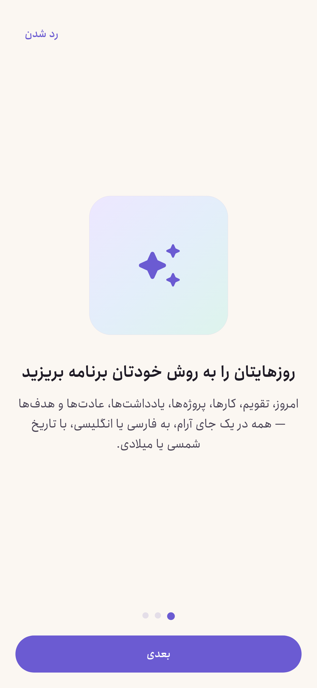
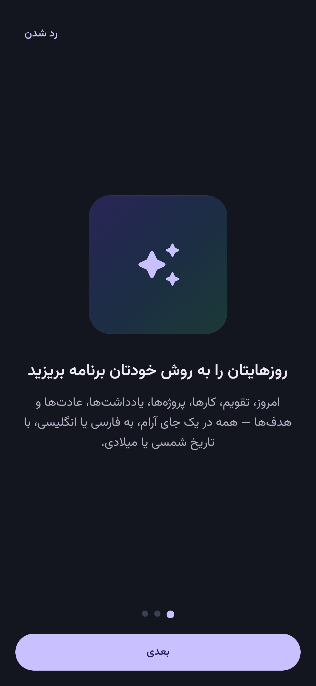
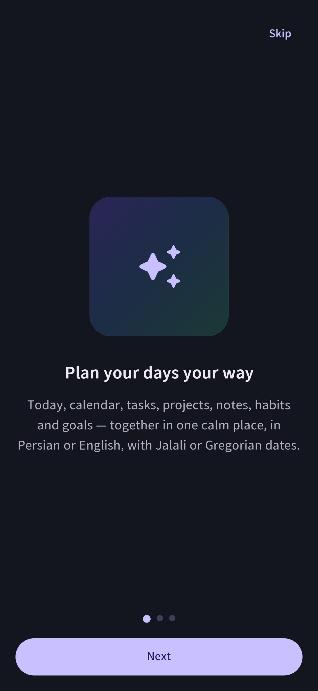
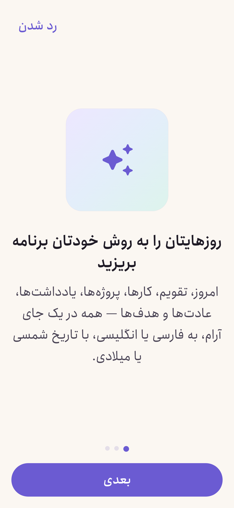

# Plan-B UI Gallery

Real screenshots of the running app: the production Hilt graph, Room database and navigation,
seeded with sample data and a frozen clock (12 Mehr 1405 / 4 Oct 2026, 10:00 Tehran), rendered
by Roborazzi on Robolectric with native graphics. Variants: Persian/English, light/dark and 150% font.
Regenerate with `./gradlew recordRoborazziDebug && python3 tools/generate_ui_gallery.py`.
Verified in CI with `./gradlew verifyRoborazziDebug`.
Total screenshots: **212**.

## Today

### `today`

| fa_light | fa_dark | en_light | en_dark | fa_light_font150 | en_light_font150 |
|---|---|---|---|---|---|
|  |  |  |  |  |  |

## Capture

### `quick_capture`

| fa_light | fa_dark | en_light | en_dark | fa_light_font150 | en_light_font150 |
|---|---|---|---|---|---|
|  |  |  |  |  |  |

## Tasks

### `task_editor`

| fa_light | fa_dark | en_light | en_dark | fa_light_font150 | en_light_font150 |
|---|---|---|---|---|---|
|  |  |  |  |  |  |

### `tasks_today`

| fa_light | fa_dark | en_light | en_dark | fa_light_font150 | en_light_font150 |
|---|---|---|---|---|---|
|  |  |  |  |  |  |

## Calendar

### `calendar_agenda`

| fa_light | fa_dark | en_light | en_dark | fa_light_font150 | en_light_font150 |
|---|---|---|---|---|---|
|  |  |  |  |  |  |

### `calendar_day`

| fa_light | fa_dark | en_light | en_dark | fa_light_font150 | en_light_font150 |
|---|---|---|---|---|---|
|  |  |  |  |  |  |

### `calendar_month`

| fa_light | fa_dark | en_light | en_dark | fa_light_font150 | en_light_font150 |
|---|---|---|---|---|---|
|  |  |  |  |  |  |

### `calendar_week`

| fa_light | fa_dark | en_light | en_dark | fa_light_font150 | en_light_font150 |
|---|---|---|---|---|---|
|  |  |  |  |  |  |

### `event_editor`

| fa_light | fa_dark | en_light | en_dark | fa_light_font150 | en_light_font150 |
|---|---|---|---|---|---|
|  |  |  |  |  |  |

## Notebooks

### `note_editor`

| fa_light | fa_dark | en_light | en_dark | fa_light_font150 | en_light_font150 |
|---|---|---|---|---|---|
|  |  |  |  |  |  |

### `notebooks`

| fa_light | fa_dark | en_light | en_dark | fa_light_font150 | en_light_font150 |
|---|---|---|---|---|---|
|  |  |  |  |  |  |

## More

### `more`

| fa_light | fa_dark | en_light | en_dark | fa_light_font150 | en_light_font150 |
|---|---|---|---|---|---|
|  |  |  |  |  |  |

## Projects

### `project_board`

| fa_light | fa_dark | en_light | en_dark | fa_light_font150 | en_light_font150 |
|---|---|---|---|---|---|
|  |  |  |  |  |  |

### `project_overview`

| fa_light | fa_dark | en_light | en_dark | fa_light_font150 | en_light_font150 |
|---|---|---|---|---|---|
|  |  |  |  |  |  |

### `projects`

| fa_light | fa_dark | en_light | en_dark | fa_light_font150 | en_light_font150 |
|---|---|---|---|---|---|
|  |  |  |  |  |  |

## Habits

### `habit_detail`

| fa_light | fa_dark | en_light | en_dark | fa_light_font150 | en_light_font150 |
|---|---|---|---|---|---|
|  |  |  |  |  |  |

### `habits`

| fa_light | fa_dark | en_light | en_dark | fa_light_font150 | en_light_font150 |
|---|---|---|---|---|---|
|  |  |  |  |  |  |

## Goals

### `goals`

| fa_light | fa_dark | en_light | en_dark | fa_light_font150 | en_light_font150 |
|---|---|---|---|---|---|
|  |  |  |  |  |  |

## Focus

### `focus`

| fa_light | fa_dark | en_light | en_dark | fa_light_font150 | en_light_font150 |
|---|---|---|---|---|---|
|  |  |  |  |  |  |

## Search

### `search_results`

| fa_light | fa_dark | en_light | en_dark | fa_light_font150 | en_light_font150 |
|---|---|---|---|---|---|
|  |  |  |  |  |  |

## Templates

### `templates`

| fa_light | fa_dark | en_light | en_dark | fa_light_font150 | en_light_font150 |
|---|---|---|---|---|---|
|  |  |  |  |  |  |

## Review

### `weekly_review`

| fa_light | fa_dark | en_light | en_dark | fa_light_font150 | en_light_font150 |
|---|---|---|---|---|---|
|  |  |  |  |  |  |

## Reports

### `my_year`

| fa_light | fa_dark | en_light | en_dark | fa_light_font150 | en_light_font150 |
|---|---|---|---|---|---|
|  |  |  |  |  |  |

### `statistics`

| fa_light | fa_dark | en_light | en_dark | fa_light_font150 | en_light_font150 |
|---|---|---|---|---|---|
|  |  |  |  |  |  |

## Settings

### `about`

| fa_light | fa_dark | en_light | en_dark | fa_light_font150 | en_light_font150 |
|---|---|---|---|---|---|
|  |  |  |  |  |  |

### `appearance`

| fa_light | fa_dark | en_light | en_dark | fa_light_font150 | en_light_font150 |
|---|---|---|---|---|---|
|  |  |  |  |  |  |

### `backup`

| fa_light | fa_dark | en_light | en_dark | fa_light_font150 | en_light_font150 |
|---|---|---|---|---|---|
|  |  |  |  |  |  |

### `settings`

| fa_light | fa_dark | en_light | en_dark | fa_light_font150 | en_light_font150 |
|---|---|---|---|---|---|
|  |  |  |  |  |  |

## Onboarding

### `onboarding`

| fa_light | fa_dark | en_light | en_dark | fa_light_font150 | en_light_font150 |
|---|---|---|---|---|---|
|  |  |  |  |  |  |

## States

### `today_empty`

| fa_light | fa_dark | en_light | en_dark | fa_light_font150 | en_light_font150 |
|---|---|---|---|---|---|
|  |  |  |  |  |  |

## Icon

### `launcher_icon`

| launcher icon |
|---|
|  |

### `launcher_icon_themed`

| launcher icon themed |
|---|
|  |

## Pro

### `paywall`

| fa_light | fa_dark | en_light | en_dark | fa_light_font150 | en_light_font150 |
|---|---|---|---|---|---|
|  |  |  |  |  |  |

## Security

### `activity`

| fa_light | fa_dark | en_light | en_dark | fa_light_font150 | en_light_font150 |
|---|---|---|---|---|---|
|  |  |  |  |  |  |

### `lock_screen`

| fa_light | fa_dark | en_light | en_dark | fa_light_font150 | en_light_font150 |
|---|---|---|---|---|---|
|  |  |  |  |  |  |

### `security_settings`

| fa_light | fa_dark | en_light | en_dark | fa_light_font150 | en_light_font150 |
|---|---|---|---|---|---|
|  |  |  |  |  |  |

### `trash`

| fa_light | fa_dark | en_light | en_dark | fa_light_font150 | en_light_font150 |
|---|---|---|---|---|---|
|  |  |  |  |  |  |
