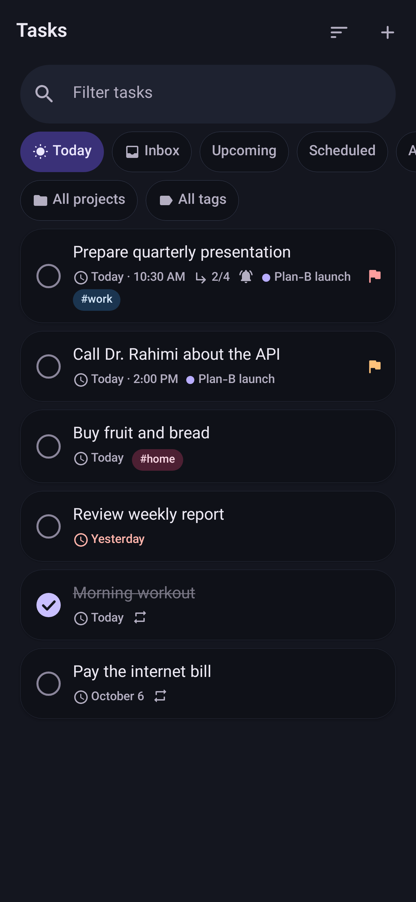
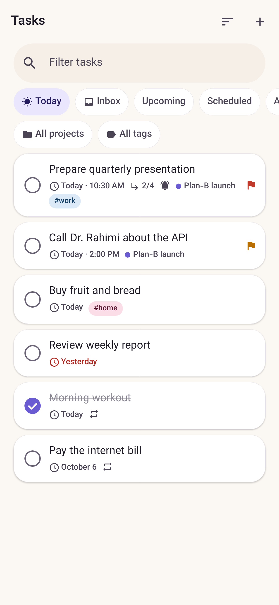
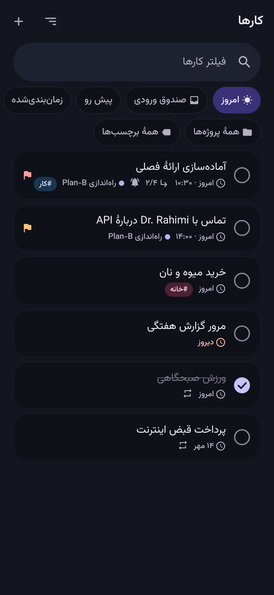
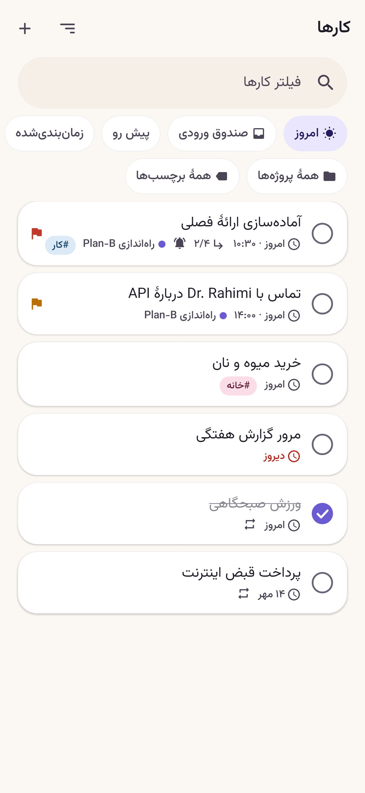

# Plan-B UI Gallery

Real screenshots rendered by Roborazzi (Robolectric, native graphics) from the production
Compose screens. Regenerate with `./gradlew recordRoborazziDebug && python3 tools/generate_ui_gallery.py`.
Verified in CI with `./gradlew verifyRoborazziDebug`.
Total screenshots: **12**.

## Today

### `today`

| en_dark | en_light | fa_dark | fa_light |
|---|---|---|---|
|  |  |  |  |

## Tasks

### `tasks`

| en_dark | en_light | fa_dark | fa_light |
|---|---|---|---|
|  |  |  |  |

## Calendar

### `calendar_month`

| en_dark | en_light | fa_dark | fa_light |
|---|---|---|---|
|  |  |  |  |
